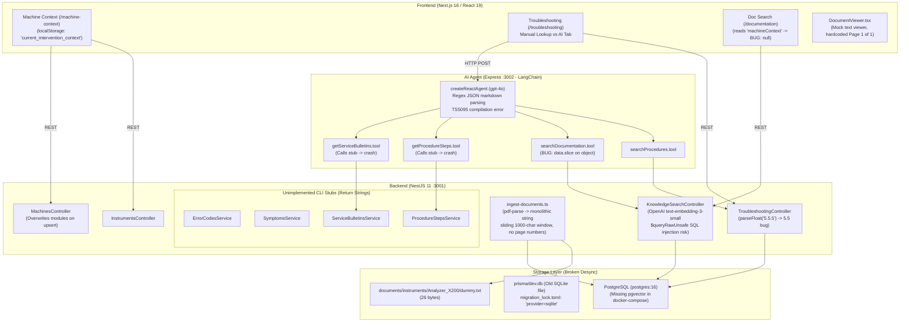
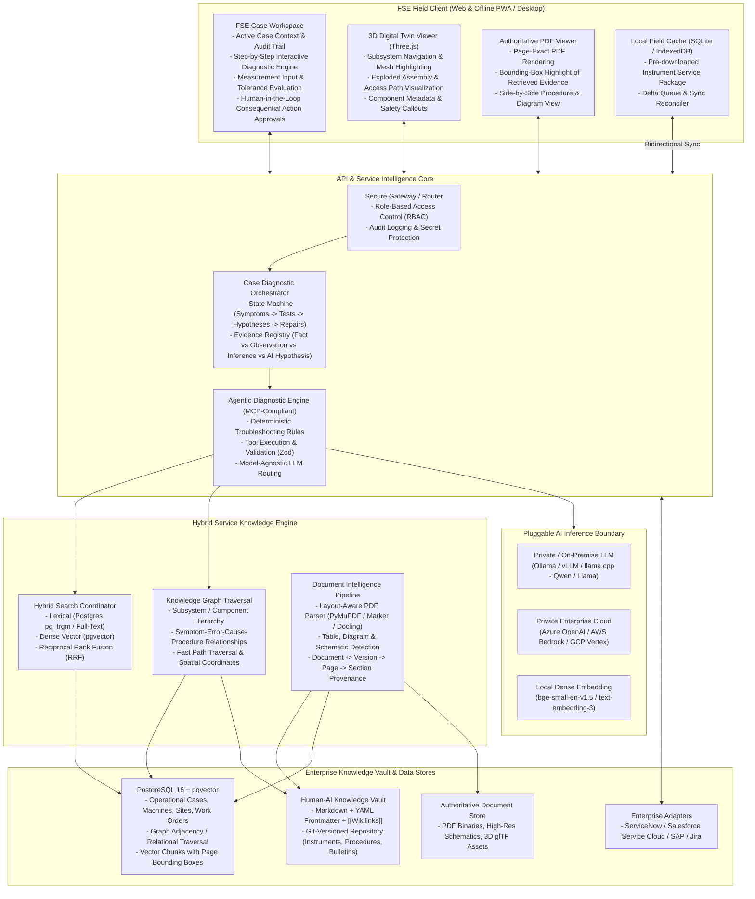
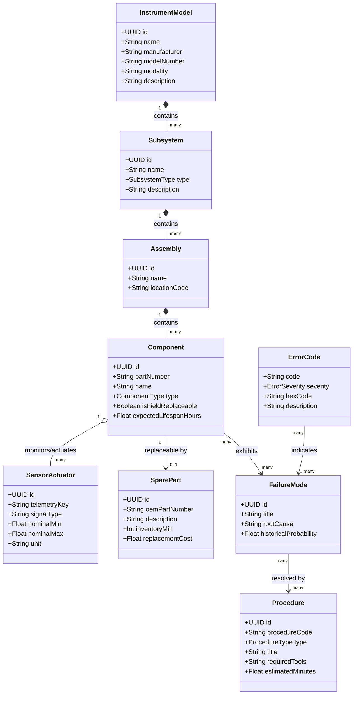
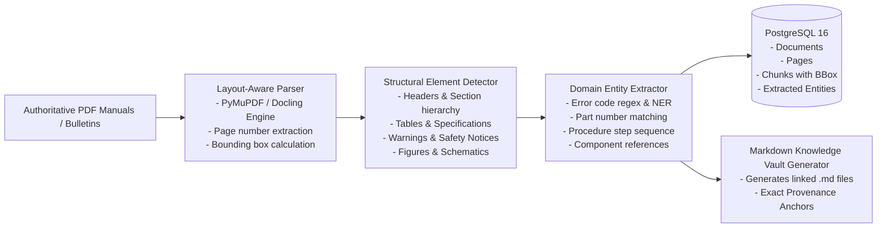
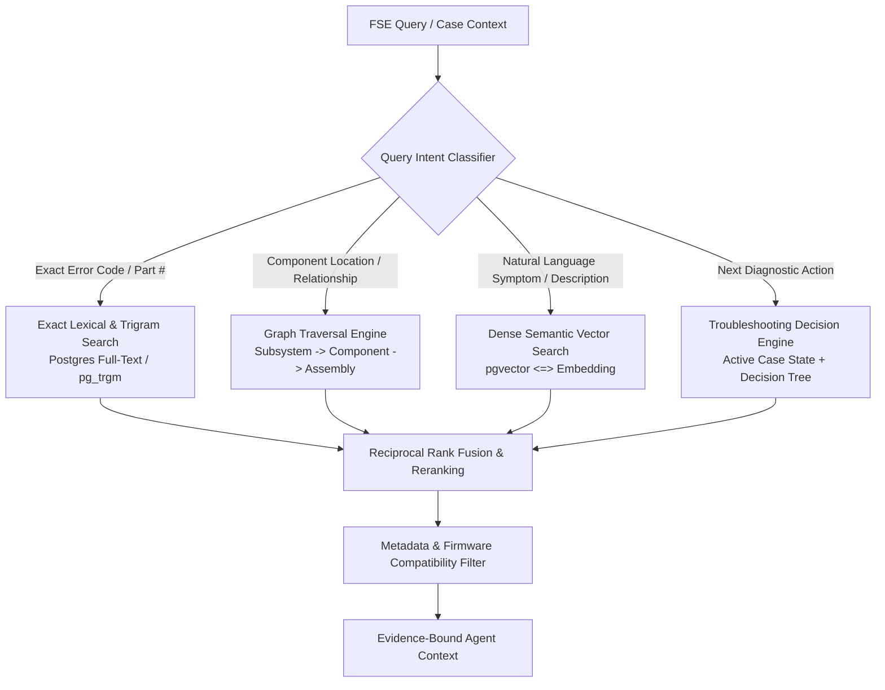
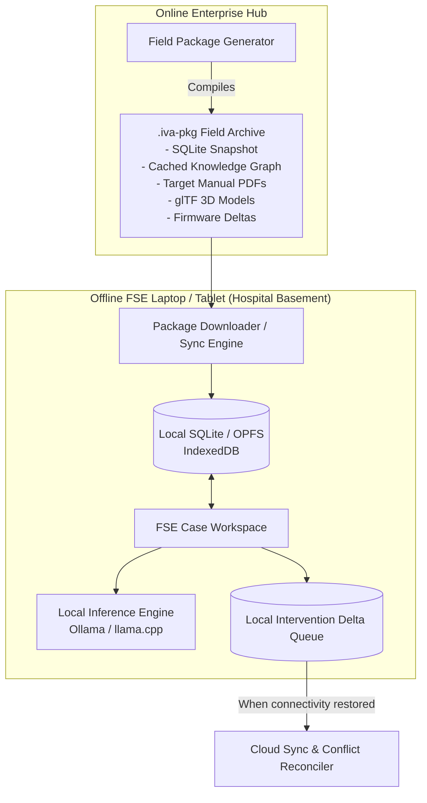
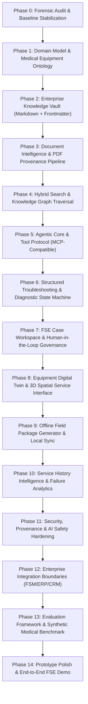

# Forensic Repository Audit & Next-Generation Architecture Assessment
**Platform:** ivA-Troubleshooter — Open-Source, AI-Native Medical Device Service Intelligence Platform  
**Target User:** Field Service Engineer (FSE)  
**Date:** September 2026  
**Auditor:** Principal Software Architect & Medical Device Systems Analyst  

---

## A. Executive Architecture Assessment

### 1. Current State Summary
The existing **ivA-troubleshooter** repository is a proof-of-concept prototype demonstrating an initial aspiration toward assisted medical equipment troubleshooting. It is structured into three loosely coupled segments:
1. **Frontend (`frontend/`)**: Next.js 16 (App Router), React 19, TailwindCSS v4. It features a basic instrument selection page, machine context initialization, a manual procedure lookup view, a documentation search view, and an "AI Assisted Plan" tab. State between pages is passed via browser `localStorage`.
2. **Backend (`backend/`)**: NestJS 11 with Prisma 6. Intended as a PostgreSQL + pgvector REST service. It defines an initial schema with `Instrument`, `Machine`, `Module`, `MachineModule`, `InterventionSession`, `Procedure`, `ProcedureStep`, `ErrorCode`, `Symptom`, `ServiceBulletin`, `Document`, and `DocumentChunk`.
3. **AI Agent (`ai-agent/`)**: An Express microservice on port 3002 utilizing `@langchain/langgraph/prebuilt` (`createReactAgent`) and `@langchain/openai`. It exposes a single `POST /ai/troubleshoot` endpoint with 4 tools that invoke the NestJS backend via HTTP.

### 2. Critical Flaws & Architectural Bottlenecks Discovered
During our deep forensic audit of the codebase, several critical structural issues, regressions, and false assumptions were identified that prevent the platform from evolving without architectural remediation:

* **Database Migration & Provider Desynchronization**:
  * `backend/prisma/schema.prisma` declares `provider = "postgresql"` and `extensions = [vector]`.
  * However, `backend/prisma/migrations/migration_lock.toml` specifies `provider = "sqlite"`.
  * The only migration file (`20260313210903_init/migration.sql`) is written in SQLite DDL (`TEXT PRIMARY KEY`, `DATETIME`).
  * An obsolete SQLite database file `prisma/dev.db` remains in the tree.
  * `docker/docker-compose.yml` specifies a vanilla `postgres:16` container without `pgvector` installed, meaning `CREATE EXTENSION vector` or vector column definitions fail upon container bootstrap.
* **Unimplemented Backend Stubs & AI Microservice Crashes**:
  * Five domain services in the backend (`error-codes`, `symptoms`, `service-bulletins`, `procedure-steps`, and parts of `procedures`) are standard NestJS CLI boilerplate generators returning unformatted plain strings (e.g., `return 'This action returns all serviceBulletins';`).
  * The `ai-agent` tools (`getProcedureSteps.tool.ts`, `getServiceBulletins.tool.ts`) perform `fetch()` against these endpoints and call `await response.json()`. Because the backend returns raw text instead of JSON, these tools throw runtime parse exceptions.
  * In `searchDocumentation.tool.ts`, the code executes `data.slice(0, 3)`. However, `KnowledgeSearchService.search()` returns an object `{ results: [...] }`. Calling `.slice` on an object throws `data.slice is not a function`.
* **TypeScript Compilation Failures & Type Safety Gaps**:
  * `ai-agent/tsconfig.json` specifies `"module": "CommonJS"` with `"moduleResolution": "bundler"`, which is an invalid TypeScript configuration resulting in compiler error `TS5095`.
  * `backend/tsconfig.json` has disabled strict typing (`"noImplicitAny": false`, `"strictBindCallApply": false`).
  * Zero automated test coverage: only two boilerplate `Hello World!` starter unit/e2e tests exist in NestJS, with zero tests in `ai-agent` or `frontend`.
* **Naive Document Extraction & Zero Provenance**:
  * `backend/src/knowledge-ingestion/ingest-documents.ts` uses `pdf-parse`, reading entire PDFs into a single monolithic string, destroying page breaks, section hierarchies, tables, schematics, and callouts.
  * Sliding-window character chunking (1,000 characters) discards page numbers entirely (`DocumentChunk` has no `pageNumber`, `sectionTitle`, or bounding box).
  * In `DocumentViewer.tsx`, page navigation is hardcoded to "Page 1 of 1" and the original document is inaccessible.
* **Naive Semantic Versioning & SQL Injection Risk**:
  * In `troubleshooting.service.ts` and `test.ts`, firmware comparisons use `parseFloat(firmwareVersion)` (e.g., `parseFloat('5.5.5')` evaluates to `5.5`), completely breaking semantic versioning.
  * In `knowledge-search.service.ts`, `$queryRawUnsafe` interpolates `instrumentId` directly into the SQL string, introducing SQL injection vulnerability.
* **Storage & Context Synchronization Errors**:
  * `frontend/app/machine-context/page.tsx` stores context in `localStorage` under `current_intervention_context`. However, `frontend/app/intervention-session/[id]/documentation/page.tsx` reads `localStorage.getItem('machineContext')`, causing `machineContext` to permanently evaluate to `null`.
  * In `frontend/app/intervention-session/[id]/procedures/[procedureId]/page.tsx`, `step.referenceDocument` is typed as a string but returned as a relational object from Prisma, leading to React rendering crashes.
* **Vendor Lock-in & Privacy Violations**:
  * The entire AI agent and embedding layer is hardcoded to OpenAI (`gpt-4o` and `text-embedding-3-small`).
  * Medical device service manuals, customer site telemetry, and service notes cannot be routed to public LLM endpoints in regulated enterprise hospital environments.
  * No model abstraction exists; offline fallback is a static, hardcoded JSON string.

### 3. What Must Change
1. **Preserve the Technology Base Where Sound**: Keep NestJS as the backend runtime, Prisma as the query builder (migrated cleanly to PostgreSQL + pgvector), Next.js App Router for the front-end, and Tailwind for design tokens.
2. **Eliminate Microservice Sprawl**: Consolidate the `ai-agent` Express microservice into a cohesive, modular NestJS AI/Agent module or unified monorepo package with formal type-sharing, eliminating out-of-process HTTP overhead, fragile port mapping, and unvalidated JSON regex parsing.
3. **Elevate to a Medical Equipment Ontology**: Replace the flat `Instrument` -> `Machine` -> `Module` schema with a hierarchical equipment ontology (Instrument -> Subsystem -> Assembly -> Component -> Sensor / Actuator -> Consumable -> Spare Part).
4. **Establish an Obsidian-Style Knowledge Vault**: Pair structured database storage with a human-readable, git-versionable Markdown knowledge vault with YAML frontmatter, wikilinks (`[[Error-E1045]]`), and bidirectional graph edges.
5. **Implement True Layout-Aware Document Intelligence**: Ingest PDFs with page-aware extraction, table parsing, callout preservation, and exact coordinate/page-level provenance back to the source PDF.
6. **Support Private/Local LLMs & Offline Field Packages**: Build a model-agnostic provider abstraction (Ollama, vLLM, OpenAI, Anthropic) and an exportable SQLite/PWA field package enabling the FSE to operate completely offline in shielded hospital basements.

---

## B. Current Architecture Diagram



---

## C. Target Architecture Diagram



---

## D. Current-vs-Target Capability Matrix

| Domain Capability | Current Implementation (`ivA-troubleshooter`) | Target Platform Architecture | Strategic Action |
|---|---|---|---|
| **Primary Persona Focus** | Generic technician view; fragmented manual search vs AI chat | Tailored **Field Service Engineer (FSE)** Case Workspace | **Refactor & Expand** |
| **Case Management** | Barebones `InterventionSession` (only engineer name and notes) | Full **Service Case Workspace** (symptoms, error codes, measurements, evidence, parts, audit trail) | **Replace Data Model** |
| **Equipment Modeling** | Flat `Instrument` -> `Machine` -> `Module` schema | Formal **Medical Device Ontology** (Instrument, Subsystem, Assembly, Component, Sensor, Actuator, Consumable, Spare Part) | **Redesign Ontology** |
| **Customer / Site Context** | Absent (machines exist in a vacuum) | `Customer`, `Site`, `InstalledBase`, `ServiceContract`, `OperatingEnvironment` | **Implement** |
| **Troubleshooting Engine** | Static list of linear `ProcedureStep`s; naive float parsing for firmware | Graph-based **Stateful Diagnostic Engine** with branching, measurements, tolerances, and human approvals | **Replace Engine** |
| **Document Ingestion** | Monolithic text dump via `pdf-parse`, character chunking, no page numbers | **Layout-aware Document Intelligence** preserving pages, sections, tables, figures, schematics, and bounding boxes | **Replace Pipeline** |
| **Knowledge Representation**| Pure SQL tables + unindexed text chunks | **Enterprise Knowledge Vault** (Markdown + YAML Frontmatter + Wikilinks + Postgres Relational Graph) | **Implement Hybrid Vault** |
| **Search & Retrieval** | Raw SQL pgvector cosine similarity without metadata filtering or page citations | **Multi-stage Hybrid Retrieval** (Exact/Lexical + Dense Vector + Graph Traversal + Reciprocal Rank Fusion) | **Replace Retrieval** |
| **Agent / AI Architecture**| Fragile LangChain `createReactAgent` in Express microservice with regex JSON parsing | Modular, observable **Agentic Diagnostic Core** with Zod schema validation, MCP compatibility, and provider abstraction | **Consolidate & Redesign** |
| **AI Model Support** | Hardcoded to public OpenAI API (`gpt-4o`, `text-embedding-3-small`) | **Model-Agnostic Provider Interface** (Local Ollama/vLLM, Private Enterprise Cloud, Hybrid Fallback) | **Implement Abstraction** |
| **Human-in-the-Loop** | None; agent dumps suggestions directly to screen | **Mandatory Approval Gates** for status changes, part replacements, escalations, and official service reports | **Implement Governance** |
| **Spatial / 3D Visualization** | None | **Interactive Browser-Based 3D Digital Twin** (Three.js / WebGL / glTF) with mesh highlighting and component linking | **Implement Spatial UI** |
| **Offline Capability** | Hardcoded mock string if `OPENAI_API_KEY` missing | **Self-contained Offline Field Package** (Local SQLite/IndexedDB, cached graph, local docs, delta sync) | **Implement Offline Core** |
| **Service History Intelligence**| None | Historical case retrieval, empirical failure clustering, statistical outcome analysis | **Implement Case Analytics** |
| **Enterprise Integrations** | None | Clean Adapter boundaries for ServiceNow, Salesforce Service Cloud, SAP, Jira | **Implement Adapters** |
| **Security & RBAC** | None (open APIs, no auth, SQL injection risks) | Enterprise RBAC, audit trails, encrypted offline storage, prompt-injection defense | **Implement Security Core** |
| **Automated Testing** | 2 default NestJS boilerplate tests | Comprehensive test pyramid: Unit, Integration, End-to-End, and Synthetic Diagnostic Benchmarks | **Implement Test Suite** |

---

## E. Technology Evaluation

### 1. Knowledge Representation
* **Markdown + YAML Frontmatter + [[Wikilinks]]**:
  * *Strengths*: Completely human-readable, git-versionable, diffable, allows medical writers and senior FSEs to maintain procedures directly; native graph structure via wikilinks.
  * *Suitability*: **Primary standard for technical service knowledge objects** (subsystems, procedures, failure modes, bulletins).
* **PostgreSQL 16 + pgvector**:
  * *Strengths*: Rock-solid transactional integrity, ACID guarantees for operational service cases, mature relational indexing, combined vector storage and relational joins in a single engine.
  * *Suitability*: **Primary operational database and vector store**. Eliminates the complexity of maintaining separate external vector databases.
* **Dedicated Graph Database (Neo4j / Memgraph)** vs **Postgres Relational Adjacency / CTEs**:
  * *Analysis*: While Neo4j offers Cypher query ergonomics, introducing a dedicated graph database increases operational deployment overhead for on-premise hospital environments. PostgreSQL with recursive Common Table Expressions (CTEs) or `Apache AGE` handles trees and directed graphs with 10,000s of medical device nodes at microsecond latencies.
  * *Decision*: Use PostgreSQL recursive relational graph structures (with adjacency tables) for the core platform, with an optional adapter for Neo4j if graph scale exceeds 1M nodes.

### 2. Search & Retrieval
* **Vector Only vs Hybrid (Lexical + Vector)**:
  * *Finding*: Pure vector search fails miserably on medical equipment codes (e.g., distinguishing "E1045" from "E1046", or finding part number "P/N 948-230-01").
  * *Decision*: **Mandatory Hybrid Search**. Combine PostgreSQL Full-Text Search (`pg_trgm` / `tsvector` with BM25 ranking) and dense embeddings (`pgvector`) using Reciprocal Rank Fusion (RRF).
* **Embedding Models**:
  * For local/private deployments: `BAAI/bge-small-en-v1.5` or `all-MiniLM-L6-v2` (high throughput, CPU-runnable, 384 dimensions).
  * For enterprise cloud deployments: `text-embedding-3-small` (1536 dims).

### 3. AI & Agent Architecture
* **Agent Framework**:
  * Current `createReactAgent` in LangGraph Express microservice adds unnecessary network hops, brittle dependency versioning, and regex-based output parsing.
  * *Decision*: Build a native, deterministic **Agentic Orchestrator in TypeScript** utilizing schema-enforced tool calling (Zod + OpenAI/Anthropic/Ollama function calling API), fully integrated into the NestJS architecture. Provide Model Context Protocol (MCP) server endpoints for interoperability with external tools and IDEs.
* **LLM Provider Abstraction**:
  * Interface: `LlmProvider` (`generateText`, `generateStructured`, `generateStream`, `embed`).
  * Adapters: `OllamaProvider` (local Llama 3.3 / Qwen 2.5), `VllmProvider` (on-prem GPU clusters), `OpenAiCompatibleProvider` (Azure OpenAI, DeepSeek, vLLM), and `AnthropicProvider`.

### 4. Document Intelligence Pipeline
* **Evaluated Tools**:
  * `pdf-parse`: Obsolete; discards formatting, tables, and page boundaries. Deprecate immediately.
  * `PyMuPDF (fitz)` / `pdfplumber`: Excellent, fast, layout-aware Python extraction; extracts text blocks with bounding boxes and page numbers.
  * `Docling` / `Marker` / `Surya`: State-of-the-art open-source layout analysis (reading order, tables, headers, formulas, OCR).
  * *Decision*: Adopt a Python-based micro-pipeline or Node-native layout parser that outputs structured JSON containing page numbers, bounding boxes, tables, and figures, mapping directly back to the source PDF.

### 5. 3D & Spatial Visualization
* **Three.js** vs **Babylon.js**:
  * *Comparison*: Three.js has the largest open-source ecosystem, lightweight bundle size, universal glTF/GLB loader support with Draco compression, and seamless React integration via `@react-three/fiber` or vanilla Canvas wrapper.
  * *Decision*: **Three.js** with `GLTFLoader` and standard mesh tagging (`userData.componentId = "PUMP_ASSEMBLY_01"`).

### 6. Offline Field Architecture
* **Evaluated Approaches**:
  * Cloud-only web app: Unacceptable; hospital basements and radiology suites have zero cellular or Wi-Fi connectivity.
  * *Decision*: **Offline Field Package Architecture**:
    * Web client equipped with Progressive Web App (PWA) Service Workers and local database (**IndexedDB** with Dexie.js or **SQLite WASM** via OPFS).
    * Exportable, compressed SQLite bundle (`.iva-pkg`) containing instrument metadata, diagnostic graph, procedure Markdown files, and thumbnail assets.
    * Bidirectional sync engine with delta tracking and Conflict-Free Replicated Data Type (CRDT) / Last-Write-Wins with manual merge fallback for service reports.

---

## F. Domain Ontology Proposal

The medical equipment domain model must represent the complex physical, operational, and clinical relationships of clinical diagnostics instrumentation.



### Core Entities:
1. **InstrumentModel**: The overarching equipment definition (e.g., *BioMed Analyzer X200*). Modalities: Clinical Chemistry, Hematology, Immunoassay, Centrifugation, Hemostasis.
2. **Subsystem**: First-order physical and functional partitions:
   * *Fluidics & Hydraulics* (Pumps, valves, tubing, degassers, waste manifolds)
   * *Optics & Photometry* (Light sources, filter wheels, flow cells, photodiode detectors)
   * *Robotics & Motion Control* (Sample pipettor arm, reagent arm, conveyor belts, XYZ steppers)
   * *Thermal & Incubation* (Reaction carousels, reagent refrigeration, heaters, Peltier elements)
   * *Power & Electronics* (Main SMPS, motor drivers, sensor controller boards, CAN bus nodes)
   * *Consumables & Loader* (Cuvette hoppers, tip racks, barcode readers, wash stations)
3. **Component**: Concrete physical entity (e.g., *Dispense Pump P-102*), with attributes:
   * OEM Part Number, Field Replaceable Unit (FRU) status, MTBF (Mean Time Between Failures), spatial 3D mesh identifier.
4. **Sensor & Actuator**: Explicit operational instrumentation:
   * Telemetry tag, expected voltage/pressure range, calibration interval.
5. **SparePart**: Supply chain record: part number, cross-reference alternatives, shelf life, ESD sensitivity.
6. **ErrorCode**: Standardized diagnostic trouble code (DTC): error code, subsystem owner, firmware applicability, severity (Fatal, Warning, Degradation).
7. **FailureMode**: Engineering root-cause classification (e.g., *Peristaltic tubing degradation*, *Optic flow cell obstruction*).
8. **Procedure**: Verified, structured resolution workflow with safety prerequisites, required tools, and step graph.

---

## G. Knowledge Architecture Proposal

### 1. Hybrid Knowledge Vault Design
Technical documentation should not be imprisoned in proprietary relational blobs or ephemeral LLM weights. We adopt an **Obsidian-compatible Knowledge Vault** coupled to the relational graph:

```text
knowledge/
├── instruments/
│   └── analyzer-x200/
│       ├── instrument.md
│       ├── subsystems/
│       │   ├── fluidics.md
│       │   ├── optics.md
│       │   └── robotics.md
│       ├── components/
│       │   ├── pump-p102.md
│       │   └── pressure-sensor-ps23.md
│       ├── errors/
│       │   ├── E1045.md
│       │   └── E1201.md
│       ├── failure-modes/
│       │   ├── FM-FLUIDICS-PRESSURE-DROP.md
│       │   └── FM-SYRINGE-LEAK.md
│       ├── procedures/
│       │   ├── PROC-PUMP-CALIBRATION.md
│       │   └── PROC-VALVE-REPLACEMENT.md
│       ├── service-bulletins/
│       │   └── SB-2026-014.md
│       └── parts/
│           └── PART-948-230-01.md
└── shared/
    ├── safety/
    │   ├── biohazard-precautions.md
    │   └── electrical-lockout-tagout.md
    └── tools/
        └── digital-manometer.md
```

### 2. Knowledge Object Specification (Example: `E1045.md`)
```markdown
---
id: "ERR-X200-E1045"
code: "E1045"
title: "Fluidics Pressure Instability"
instrument: "[[Analyzer-X200]]"
subsystem: "[[Fluidics]]"
severity: "WARNING"
firmware_min: "4.0.0"
firmware_max: "6.5.0"
affected_components:
  - "[[Pump-P102]]"
  - "[[Pressure-Sensor-PS23]]"
likely_failure_modes:
  - "[[FM-FLUIDICS-PRESSURE-DROP]]"
procedures:
  - "[[PROC-PUMP-CALIBRATION]]"
  - "[[PROC-PRESSURE-LINE-BLEED]]"
bulletins:
  - "[[SB-2026-014]]"
last_updated: "2026-03-15"
---

# Error E1045: Fluidics Pressure Instability

## Diagnostic Definition
The fluidics subsystem detected pressure oscillation exceeding ±15% of the baseline setpoint (120 kPa) during sample aspiration or reagent dispensing cycles.

> [!CAUTION] Biohazard & Chemical Hazard
> Decontaminate fluidics lines prior to breaking hydraulic fittings. Wear standard PPE.

## Deterministic Verification Steps
1. Execute diagnostic routine `DIAG-PUMP-PURGE-01`.
2. Inspect tubing between [[Pump-P102]] and [[Pressure-Sensor-PS23]] for micro-bubbles.
3. If pressure reading is < 100 kPa, refer to [[FM-FLUIDICS-PRESSURE-DROP]].
```

### 3. Bidirectional Knowledge Sync
* The markdown files serve as the human-curated and AI-navigable source of truth.
* A file-watcher / ingestion service parses YAML frontmatter and `[[wikilinks]]` into PostgreSQL adjacency edges upon git commit or document upload, ensuring search indexes and graph traversals are always synchronized.

---

## H. Document Ingestion Proposal

### 1. Ingestion Architecture



### 2. Concrete Provenance Model
Every indexed chunk and extracted knowledge entity must store:
* `document_id`: Foreign key to authoritative source PDF.
* `document_version`: Revision number / publication date.
* `page_number`: Exact 1-based page index.
* `bounding_box`: `[x0, y0, x1, y1]` coordinates on the PDF page.
* `section_breadcrumb`: e.g., `"Section 4: Fluidics > 4.2 Maintenance > Calibration"`.
* `content_hash`: SHA-256 hash for tamper detection.

This enables the UI to render the actual PDF page side-by-side with an amber highlight over the exact bounding box, providing total auditability for clinical compliance.

---

## I. Retrieval & Agent Architecture Proposal

### 1. Adaptive Multi-Stage Retrieval
Rather than passing every query to a single vector search, the retrieval engine routes adaptively based on query intent:



### 2. Tool Architecture (MCP-Compatible)
The agent executes through strictly validated, observable tools:
* `search_knowledge_hybrid(query, instrument_id, firmware_version)`
* `get_component_details(component_id)`
* `get_troubleshooting_tree(error_code, symptom_id)`
* `record_diagnostic_measurement(case_id, test_id, measured_value, unit)`
* `get_service_bulletins(instrument_id, firmware_version)`
* `get_document_page_provenance(document_id, page_number)`
* `query_historical_cases(symptom, component_id, error_code)`
* `request_human_approval(action_type, description, justification)`

---

## J. Equipment Digital Twin & 3D Spatial Proposal

### 1. Spatial Service Interface Architecture
* **Format**: Standard `glTF 2.0 / GLB` format with Draco compression for fast loading over constrained field networks.
* **Component-Mesh Tagging**: Every inspectable 3D mesh node is tagged with its domain ontology ID in the glTF `extras.componentId` property.
* **Spatial Capabilities**:
  * **Isolate Subsystem**: Hides surrounding chassis and irrelevant subsystems to focus on the target area (e.g., Fluidics manifold).
  * **Explode Assembly**: Interpolates sub-assemblies along disassembly vectors to expose obscured fasteners, sensors, or tubing.
  * **Highlight & Blink**: Directly highlights components flagged by diagnostic reasoning (e.g., glowing amber for suspected pump, red for failed sensor).
  * **Interactive Hotspots**: Clicking any component in the 3D viewport opens a contextual inspector displaying: Part Number, Specifications, Service Procedures, Recent Failure Rate, and Replacement Guide.

---

## K. Offline Architecture Proposal



### Key Offline Invariants:
1. **Scope Limitation**: The FSE downloads only packages relevant to their upcoming site visits and assigned instruments, avoiding multi-gigabyte corporate downloads.
2. **Deterministic Fallback**: All core decision trees and procedures are compiled into structured local SQLite tables; AI inference enhances guidance but is never a single point of failure.
3. **Audit Immutability**: All measurements, timestamps, and technician signatures recorded offline are cryptographically signed locally and queued in append-only storage until synchronized.

---

## L. Security Architecture

1. **Role-Based Access Control (RBAC)**:
   * Roles: `FieldServiceEngineer`, `HotlineSupport`, `ServiceManager`, `SystemAdmin`, `ClinicalCustomer`.
   * Enforced at the GraphQL/REST API gateway and propagated into document and case filters.
2. **Data Isolation & Multi-Tenancy**:
   * Customer site names, patient-adjacent sample identifiers, and proprietary OEM schematics are partitioned with tenant and customer-level isolation keys.
3. **AI Safety & Prompt Injection Hardening**:
   * Tool calls are strictly typed with Zod schemas; arbitrary shell commands or direct SQL execution by agents is strictly prohibited.
   * Retrieved document contents are sanitized and wrapped in unambiguous markdown delimiters (`<evidence_document id="...">`) to resist document poisoning.
4. **Secret Management**:
   * No hardcoded API keys; all external connections (OpenAI, AWS Bedrock, ServiceNow) leverage encrypted environment variables or vault secret stores.

---

## M. Integration Architecture

The platform acts as an **intelligence layer** complementing rather than replacing existing enterprise platforms:
* **ServiceNow / Salesforce Field Service**: Ingest assigned Work Orders; synchronize final diagnostic summaries, parts consumed, and labor duration.
* **Jira / GitHub Issues**: Escalate unresolved, novel failure modes directly to OEM R&D engineering teams with complete diagnostic telemetry and reproduction traces.
* **Inventory / ERP (SAP)**: Query real-time local trunk stock and warehouse availability for recommended replacement parts.

---

## N. Data Model Evolution (Prisma Schema Migration Plan)

The database schema will transition from the initial flat tables to a robust, normalized relational model:

```prisma
// Core Equipment Ontology
model InstrumentModel {
  id              String       @id @default(uuid())
  manufacturer    String
  modelName       String       @unique
  modality        String
  description     String?
  subsystems      Subsystem[]
  assets          InstalledAsset[]
  documents       Document[]
  procedures      Procedure[]
  errorCodes      ErrorCode[]
  bulletins       ServiceBulletin[]
  createdAt       DateTime     @default(now())
  updatedAt       DateTime     @updatedAt
}

model Subsystem {
  id                String       @id @default(uuid())
  instrumentModelId String
  instrumentModel   InstrumentModel @relation(fields: [instrumentModelId], references: [id])
  name              String
  code              String       // e.g. "FLUIDICS", "OPTICS"
  description       String?
  assemblies        Assembly[]
}

model Assembly {
  id          String      @id @default(uuid())
  subsystemId String
  subsystem   Subsystem   @relation(fields: [subsystemId], references: [id])
  name        String
  components  Component[]
}

model Component {
  id                String          @id @default(uuid())
  assemblyId        String
  assembly          Assembly        @relation(fields: [assemblyId], references: [id])
  name              String
  partNumber        String          @unique
  isFieldReplaceable Boolean        @default(true)
  meshNodeId        String?         // 3D glTF link
  failureModes      ComponentFailureMode[]
  sensors           Sensor[]
}

model Sensor {
  id          String     @id @default(uuid())
  componentId String
  component   Component  @relation(fields: [componentId], references: [id])
  name        String
  telemetryTag String
  nominalMin  Float?
  nominalMax  Float?
  unit        String?
}

// Enterprise Operational Entities
model CustomerSite {
  id          String           @id @default(uuid())
  name        String
  hospitalSystem String?
  city        String
  country     String
  assets      InstalledAsset[]
}

model InstalledAsset {
  id                String          @id @default(uuid())
  serialNumber      String          @unique
  instrumentModelId String
  instrumentModel   InstrumentModel @relation(fields: [instrumentModelId], references: [id])
  siteId            String
  site              CustomerSite    @relation(fields: [siteId], references: [id])
  firmwareVersion   String
  installationDate  DateTime
  cases             ServiceCase[]
}

// Service Case Workspace
model ServiceCase {
  id              String            @id @default(uuid())
  caseNumber      String            @unique
  assetId         String
  asset           InstalledAsset    @relation(fields: [assetId], references: [id])
  engineerId      String
  status          CaseStatus        // OPEN, IN_DIAGNOSIS, REPAIR_PENDING, RESOLVED, ESCALATED
  primarySymptom  String
  errorCodeId     String?
  errorCode       ErrorCode?        @relation(fields: [errorCodeId], references: [id])
  diagnosticState Json              // Active state machine snapshot
  measurements    CaseMeasurement[]
  interventions   CaseAction[]
  resolutionSummary String?
  createdAt       DateTime          @default(now())
  updatedAt       DateTime          @updatedAt
}

model CaseMeasurement {
  id            String      @id @default(uuid())
  caseId        String
  case          ServiceCase @relation(fields: [caseId], references: [id])
  testName      String
  measuredValue Float
  expectedMin   Float?
  expectedMax   Float?
  unit          String
  passed        Boolean
  takenAt       DateTime    @default(now())
}

model CaseAction {
  id            String      @id @default(uuid())
  caseId        String
  case          ServiceCase @relation(fields: [caseId], references: [id])
  actionType    String      // PROCEDURE_STEP, PART_REPLACED, CALIBRATION, ESCALATION
  description   String
  requiresApproval Boolean  @default(false)
  approvedBy    String?
  approvedAt    DateTime?
  performedAt   DateTime    @default(now())
}
```

---

## O. Documentation Plan

The following formal documentation deliverables will be maintained under `docs/`:
1. **Master Architecture & Audits**: `docs/architecture/`
2. **Architecture Decision Records**: `docs/adr/` (ADR-001 through ADR-008)
3. **Phase Implementation Plans**: `docs/plans/` (Phase 0 through Phase 14)
4. **Knowledge Vault Guide**: `docs/knowledge-vault-spec.md`
5. **Ontology Data Dictionary**: `docs/ontology-dictionary.md`
6. **Agent & Tool Protocol Specification**: `docs/agent-tool-protocol.md`

---

## P. Testing & Evaluation Strategy

1. **Unit Testing**:
   * Jest/Vitest for NestJS services and domain models.
   * Semver parsing, measurement tolerance validation, and graph traversal logic tested to 100% coverage.
2. **Integration Testing**:
   * PostgreSQL testcontainers verifying Prisma queries, pgvector cosine search, and recursive CTE graph traversal.
3. **Synthetic Diagnostic Benchmark**:
   * A synthetic benchmark suite containing 25 verified clinical diagnostic failure scenarios (e.g., *Pressure drop during sample intake on Analyzer X200*).
   * Metrics measured:
     * **Diagnostic Precision**: Percentage of correct suspected components identified in top-2 candidates.
     * **Retrieval Recall**: Percentage of relevant manual pages/bulletins retrieved.
     * **Hallucination Rate**: Zero tolerance for fabricated part numbers, steps, or tolerances.
     * **Approval Compliance**: Verification that no consequential actions execute without human confirmation.

---

## Q. Risks & Unknowns

| Risk Description | Severity | Probability | Mitigation Strategy |
|---|---|---|---|
| **Local LLM Performance on Edge Hardware** | High | Medium | Standardize on quantized models (e.g., Qwen 2.5 7B Q4_K_M or Llama 3.3 8B); fall back to deterministic decision trees when local hardware lacks GPU. |
| **Complex CAD to Web 3D Conversion** | Medium | Medium | Use optimized glTF/GLB pipelines with Draco compression; provide simplified synthetic low-poly 3D models for initial prototype instruments. |
| **PDF Extraction Variance across OEMs** | High | High | Build a multi-tier extractor: direct digital text extraction first; fallback to OCR + table vision models for legacy scanned manuals. |
| **Offline Data Conflicts during Sync** | Medium | Low | Service cases are assigned to a single primary FSE per intervention; enforce immutable append-only event logs for case telemetry. |

---

## R. Deprecated Technologies & Components

* **`prisma/dev.db`**: Deprecate and remove immediately.
* **`backend/prisma/migrations/20260313210903_init`**: Archive and regenerate fresh PostgreSQL migrations.
* **`ai-agent/` Express Microservice**: Deprecate as an external microservice; consolidate into NestJS AI module or monorepo agent package with direct in-process calling.
* **`pdf-parse` naive ingestion script**: Replace with layout-aware document intelligence pipeline.
* **`tracked_files.txt`**: Remove 2.4MB git dump artifact from repository root.
* **Unimplemented CLI stubs**: Replace with production-grade controllers and services.

---

## S. Recommended Implementation Sequence


